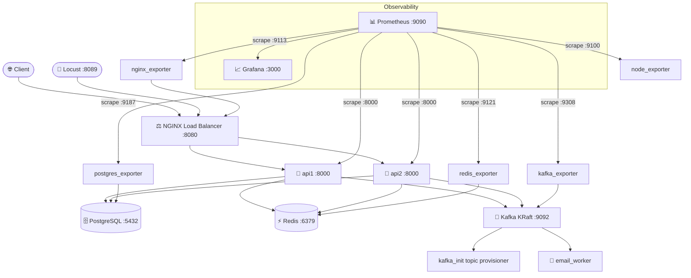

<div align="center">

# 🎮 Retro Video Game Exchange API

**A fully distributed REST API for trading retro video games.**


*Built for CSC380 — demonstrates service-oriented architecture, distributed systems, observability, and fault-tolerant design.*

</div>

---

## 📐 Architecture



---

## ✨ Features

### Core API
- User self-registration and JWT-based authentication
- Full CRUD for retro video games with search, filtering, and pagination
- Trade offer lifecycle: create → view incoming/outgoing → accept or reject
- Owner-restricted mutations — only the game owner can update, delete, or decide on offers
- **RMM Level 3 / HATEOAS** — every response includes `_links` for hypermedia-driven navigation
- Consistent JSON error envelopes across all endpoints
- Interactive OpenAPI docs (Swagger UI)

### Distributed Rate Limiting — Redis
- Per-IP sliding-window rate limits enforced via an atomic Redis Lua script — no race conditions across `api1` and `api2`
- Endpoint-specific limits (login, registration, game search, offer creation) with a configurable global fallback
- 1.5× burst multiplier allows short spikes without penalising legitimate users
- Fail-open: if Redis is unavailable, requests are allowed rather than silently dropped
- All rejections counted in Prometheus with a `client_ip` label for attacker identification

### Async Event Streaming — Kafka
- Domain-separated topics: `users` (registration events) and `offers` (offer created / decided)
- `email_worker` consumes both topics and sends transactional emails via SMTP
- Producer is fail-open — a Kafka outage never affects the HTTP response path
- `kafka_init` provisions both topics on startup before any API instance starts

### Observability — Prometheus + Grafana
- 4 custom metrics instrumented directly in the API code
- 6 Prometheus scrape targets: API nodes, PostgreSQL, Kafka, NGINX, Redis, host node
- 4 pre-provisioned Grafana dashboards — loaded automatically at startup, no manual configuration needed

### Load Simulation — Locust
- 4 concurrent adversarial user classes prove the system behaves correctly under attack
- Web UI at `:8089` for interactive runs; headless mode supported

---

## 🧱 Technology Stack

| Layer | Technology |
|---|---|
| API framework | FastAPI 0.128 + Uvicorn |
| Language | Python 3.11 |
| ORM / Database | SQLAlchemy 2 + PostgreSQL 16 |
| Authentication | JWT (python-jose) + bcrypt |
| Validation | Pydantic v2 |
| Rate limiting | Redis 7 (sliding-window Lua script) |
| Message streaming | Apache Kafka 3.7 (KRaft — no ZooKeeper) |
| Load balancer | NGINX (Alpine) |
| Metrics | prometheus-client (custom) + 5 exporters |
| Dashboards | Grafana 9.5 (file-provisioned) |
| Load simulation | Locust 2.24 |
| Containerisation | Docker + Docker Compose |

---

## 🗂️ Services & Ports

| Service | Image | Host Port | Purpose |
|---|---|---|---|
| `nginx` | nginx:alpine | **8080** | Round-robin load balancer (entry point) |
| `api1` | local build | — | FastAPI instance 1 |
| `api2` | local build | — | FastAPI instance 2 |
| `db` | postgres:16-alpine | 5432 | Shared PostgreSQL database |
| `redis` | redis:7-alpine | 6379 | Distributed rate-limit state |
| `kafka` | apache/kafka:3.7.0 | 9092 | KRaft message broker |
| `email_worker` | local build | — | Kafka consumer → SMTP emails |
| `kafka_init` | apache/kafka:3.7.0 | — | One-shot topic provisioner |
| `prometheus` | prom/prometheus | **9090** | Metrics collection and storage |
| `grafana` | grafana/grafana:9.5.0 | **3000** | Dashboard visualisation |
| `postgres_exporter` | prometheuscommunity/postgres-exporter | 9187 | PostgreSQL → Prometheus |
| `kafka_exporter` | danielqsj/kafka-exporter | 9308 | Kafka → Prometheus |
| `nginx_exporter` | nginx/nginx-prometheus-exporter | 9113 | NGINX → Prometheus |
| `node_exporter` | prom/node-exporter | 9100 | Host OS → Prometheus |
| `redis_exporter` | oliver006/redis_exporter | 9121 | Redis → Prometheus |
| `locust` | locustio/locust:2.24.0 | **8089** | Load and attack simulation |

---

## 🚀 Getting Started

### Prerequisites
- [Docker Desktop](https://www.docker.com/products/docker-desktop/) (includes Docker Compose)

### Run the full stack

```bash
git clone https://github.com/LorenzoF765/lf-retro-exchange-api
cd lf-retro-exchange-api
docker compose up --build
```

Wait ~60 seconds for Kafka to pass its health check, then confirm all 19 containers are up:

```bash
docker compose ps
```

### Access points

| Interface | URL | Credentials |
|---|---|---|
| API (via NGINX) | http://localhost:8080/api | — |
| Swagger UI | http://localhost:8080/docs | — |
| Health check | http://localhost:8080/health | — |
| Prometheus metrics | http://localhost:8080/metrics | — |
| Prometheus UI | http://localhost:9090 | — |
| Grafana | http://localhost:3000 | admin / admin |
| Locust | http://localhost:8089 | — |

### Tear down

```bash
docker compose down -v   # -v removes volumes and wipes the database
```

---

## 🔐 Authentication

All endpoints except registration and login require a `Bearer` token.

**Register**
```http
POST /api/users
Content-Type: application/json

{
  "name": "Jane Smith",
  "email": "jane@example.com",
  "password": "Secure123!",
  "street_address": "1 Main St"
}
```

**Login → receive token**
```http
POST /api/auth/token
Content-Type: application/json

{
  "email": "jane@example.com",
  "password": "Secure123!"
}
```
```json
{ "access_token": "eyJ...", "token_type": "bearer" }
```

Use the token on every subsequent request:
```http
Authorization: Bearer eyJ...
```

---

## 👤 User Endpoints

| Method | Path | Auth | Description |
|---|---|---|---|
| `POST` | `/api/users` | ❌ | Register a new user |
| `GET` | `/api/users/me` | ✅ | Get your own profile |
| `GET` | `/api/users/{id}` | ✅ | Get any user by ID |
| `PUT` | `/api/users/{id}` | ✅ | Update your own profile (self only) |

---

## 🎮 Game Endpoints

| Method | Path | Auth | Description |
|---|---|---|---|
| `POST` | `/api/games` | ✅ | List a game you own |
| `GET` | `/api/games` | ✅ | Search / list all games (paginated) |
| `GET` | `/api/games/{id}` | ✅ | Get a single game |
| `PUT` | `/api/games/{id}` | ✅ | Update your game (owner only) |
| `DELETE` | `/api/games/{id}` | ✅ | Delete your game (owner only) |

**Search parameters:** `name`, `publisher`, `system`, `condition`, `year`, `yearMin`, `yearMax`, `ownerId`, `page`, `pageSize`

**Condition values:** `mint` · `good` · `fair` · `poor`

**Example body:**
```json
{
  "name": "Chrono Trigger",
  "publisher": "Square",
  "year_published": 1995,
  "system": "SNES",
  "condition": "good",
  "previous_owners": 2
}
```

---

## 🔁 Trade Offer Endpoints

| Method | Path | Auth | Description |
|---|---|---|---|
| `POST` | `/api/offers` | ✅ | Propose a trade |
| `GET` | `/api/offers/incoming` | ✅ | View offers targeting your games |
| `GET` | `/api/offers/outgoing` | ✅ | View offers you have made |
| `POST` | `/api/offers/{id}/decision` | ✅ | Accept or reject (owner of requested game only) |

**Offer states:** `pending` → `accepted` or `rejected`

```json
{ "requested_game_id": 12, "offered_game_id": 5 }
```
```json
{ "decision": "accepted" }
```

---

## 🔗 HATEOAS — RMM Level 3

Every response includes a `_links` block. Clients navigate entirely through links — no hard-coded URLs required. Owner-only actions (`update`, `delete`, `decide`) are **omitted** when the requesting user is not the owner.

```json
{
  "id": 1,
  "name": "Chrono Trigger",
  "_links": {
    "self":       { "href": "/api/games/1" },
    "owner":      { "href": "/api/users/3" },
    "update":     { "href": "/api/games/1", "method": "PUT" },
    "delete":     { "href": "/api/games/1", "method": "DELETE" },
    "collection": { "href": "/api/games" }
  }
}
```

---

## ⚡ Distributed Rate Limiting

Rate limits are enforced per client IP using a **Redis sorted-set sliding window** executed as an atomic Lua script. Correctness is guaranteed even when NGINX distributes load across both API instances.

| Endpoint prefix | Limit | Window |
|---|---|---|
| `/api/auth/token` | 10 req | 60 s |
| `/api/users` | 10 req | 60 s |
| `/api/games` | 30 req | 60 s |
| `/api/offers` | 20 req | 60 s |
| All others | 100 req | 60 s |

A **1.5× burst multiplier** allows short spikes above the base limit. `/health`, `/metrics`, and `/docs` are permanently exempt. If Redis is unreachable, requests are **allowed** (fail-open).

```json
{
  "error": {
    "code": "RATE_LIMIT_EXCEEDED",
    "message": "Too many requests. Limit is 10 per 60s. Retry after 60 seconds."
  }
}
```

---

## 📡 Kafka Event Streaming

When significant events occur, the API publishes a JSON message to the appropriate domain topic. The `email_worker` service subscribes to both topics and sends transactional emails.

| Event | Topic | Trigger |
|---|---|---|
| `user.registered` | `users` | New account created |
| `offer.created` | `offers` | Trade offer submitted |
| `offer.decided` | `offers` | Offer accepted or rejected |

The producer is **fail-open** — a Kafka outage is logged but never surfaces to the HTTP caller.

---

## 📊 Observability

### Custom Prometheus Metrics

| Metric | Type | Labels | Where defined |
|---|---|---|---|
| `retro_api_requests_total` | Counter | `method`, `endpoint`, `http_status` | `app/main.py` |
| `retro_api_request_latency_seconds` | Histogram | `endpoint` | `app/main.py` |
| `rate_limit_requests_rejected_total` | Counter | `endpoint`, `client_ip` | `app/rate_limit.py` |
| `rate_limit_check_duration_seconds` | Histogram | — | `app/rate_limit.py` |

Infrastructure metrics come from five exporters (PostgreSQL, Kafka, NGINX, Redis, host node), all scraped every **5 seconds**. Raw metrics: `http://localhost:8080/metrics`

### Grafana Dashboards

All four dashboards are provisioned automatically — login at `http://localhost:3000` with **admin / admin**.

| Dashboard | Key panels |
|---|---|
| **Retro API Overview** | Requests/sec, p95 latency, 4xx/5xx error rate, active instances |
| **Security & Rate Limiting** | 429 rate by endpoint, Redis round-trip latency p95, total vs rejected traffic, top offending IPs |
| **Kafka Overview** | Messages/sec per topic (`users` + `offers`), consumer lag, topic partitions |
| **Postgres Overview** | Active connections, queries/sec, buffer cache hit ratio |

---

## 🦗 Load Simulation — Locust

Four user classes run concurrently to stress-test the system:

| Class | Weight | Wait time | Behaviour |
|---|---|---|---|
| `RetroApiUser` | 5 | 1–3 s | Normal authenticated traffic — should never be rate-limited |
| `DDoSUser` | 1 | 10–50 ms | Floods every endpoint unauthenticated — triggers 429s visible in Grafana |
| `CredentialStuffer` | 1 | 100–500 ms | Rapid wrong-password logins — 401s expected, 429s flagged as failures |
| `SlowRateUser` | 1 | 6–10 s | Requests just below threshold — designed to evade naive limiters |

**Start from the web UI:** http://localhost:8089

**Run headlessly:**
```bash
docker compose run --rm locust \
  -f /locustfile.py --host http://nginx:80 \
  --headless -u 20 -r 5 --run-time 60s
```

> A high failure rate (60–70%) at low user counts is **expected and correct** — it is caused entirely by `DDoSUser` exhausting rate-limit buckets. `RetroApiUser` tasks (`/health`, `/api/users`) show near-zero failures, demonstrating that legitimate traffic is never blocked.

---

## ❗ Error Handling

All errors follow a consistent envelope:

```json
{
  "error": {
    "code": "FORBIDDEN",
    "message": "Only the owner may update this game",
    "details": {}
  }
}
```

| Status | Code | Cause |
|---|---|---|
| `400` | `INVALID_OFFER` | Business logic violation (e.g. requesting your own game) |
| `401` | `AUTH_REQUIRED` / `INVALID_TOKEN` | Missing or expired JWT |
| `403` | `FORBIDDEN` | Authenticated but not permitted for this resource |
| `404` | `NOT_FOUND` | Resource does not exist |
| `409` | `EMAIL_IN_USE` | Duplicate registration attempt |
| `422` | `VALIDATION_ERROR` | Request body fails schema validation |
| `429` | `RATE_LIMIT_EXCEEDED` | Too many requests from this IP |

---

## 📂 Project Structure

```
lf-retro-exchange-api/
├── app/
│   ├── routers/
│   │   ├── auth.py            # POST /api/auth/token
│   │   ├── users.py           # /api/users/*
│   │   ├── games.py           # /api/games/*
│   │   └── offers.py          # /api/offers/*
│   ├── main.py                # App factory, middleware, Prometheus metrics, /metrics
│   ├── rate_limit.py          # Redis sliding-window rate-limit middleware
│   ├── notifications.py       # Kafka producer — routes events to users/offers topics
│   ├── email_worker.py        # Kafka consumer — sends transactional emails
│   ├── kafka_producer.py      # Async Kafka producer (aiokafka)
│   ├── auth.py                # JWT create/verify, bcrypt hashing
│   ├── db.py                  # SQLAlchemy engine and session factory
│   ├── models.py              # ORM models (User, Game, TradeOffer)
│   ├── schemas.py             # Pydantic request/response schemas
│   ├── deps.py                # FastAPI dependency injection
│   ├── errors.py              # Structured HTTP error helper
│   ├── hateoas.py             # _links builders
│   └── __init__.py
├── nginx/
│   ├── nginx.conf             # Round-robin upstream, /stub_status for exporter
│   └── Dockerfile
├── prometheus/
│   └── prometheus.yml         # 6 scrape jobs, 5 s interval
├── grafana/
│   ├── provisioning/
│   │   ├── datasources/prometheus.yaml
│   │   └── dashboards/dashboard.yaml
│   └── dashboards/
│       ├── retro_api_dashboard.json
│       ├── security_rate_limiting.json
│       ├── kafka_overview.json
│       └── postgres_overview.json
├── locustfile.py              # 4 adversarial user classes
├── Dockerfile                 # API image (python:3.11-slim)
├── docker-compose.yaml        # 19 services
├── requirements.txt
└── .env                       # Local environment overrides
```

---

## 🗄️ Database

- **PostgreSQL 16** shared between `api1` and `api2`
- Schema initialised exclusively by `api1` (`DB_INIT=1`) to prevent startup race conditions
- SQLAlchemy connection pool: `pool_size=5`, `max_overflow=10`, `pool_pre_ping=True`
- Data persisted in a named Docker volume (`retro_db`) — survives container restarts

---

<div align="center">
<sub>Developed by LF · CSC380 Distributed Systems</sub>
</div>
